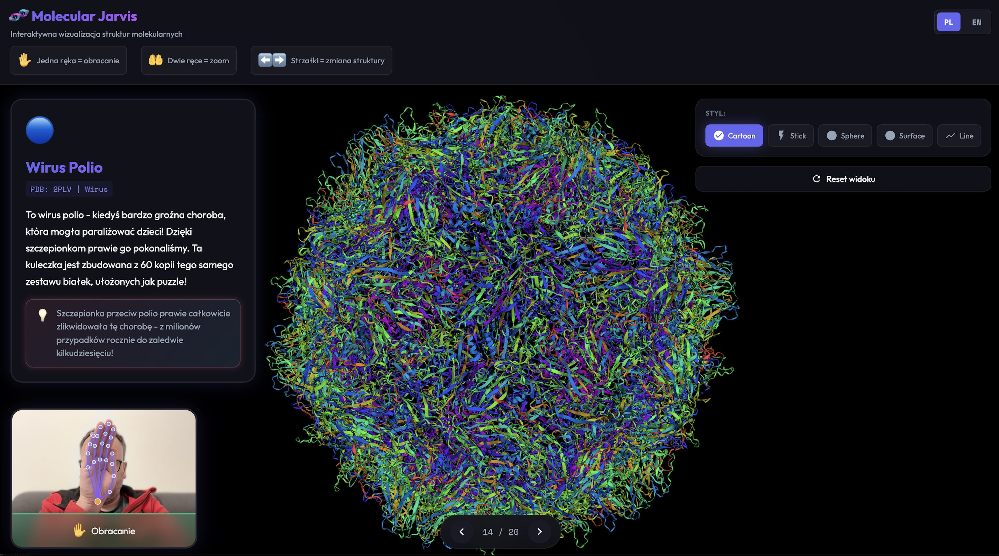
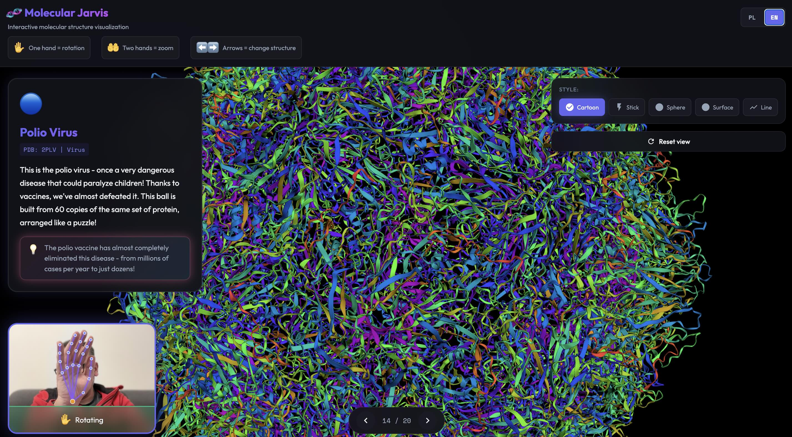

# 🧬 Molecular Jarvis

[English version below](#english-version)

## 🇵🇱 Wersja Polska

### 📖 Opis

**Molecular Jarvis** to interaktywna aplikacja webowa do wizualizacji struktur molekularnych 3D, sterowana gestami dłoni przy użyciu MediaPipe i 3Dmol.js. Projekt umożliwia eksplorację 20 różnych struktur molekularnych w przystępny i intuicyjny sposób - wystarczy pokazać dłoń przed kamerą!



### ✨ Funkcje

- 🤚 **Sterowanie gestami dłoni** - jedna ręka obraca strukturę, dwie ręce to zoom
- 🎨 **5 stylów wizualizacji** - Cartoon, Stick, Sphere, Surface, Line
- 🧬 **20 struktur białek** - od hemoglobiny po wirusa polio
- 🌍 **Dwujęzyczny interfejs** - Polski i Angielski
- 📱 **Responsywny design** - działa na komputerach i tabletach
- 🎯 **Edukacyjne opisy** - każda struktura zawiera ciekawe fakty
- ⌨️ **Nawigacja klawiaturą** - strzałki do przełączania struktur

### 🛠️ Technologie

- **3Dmol.js** - wizualizacja struktur molekularnych
- **MediaPipe Hands** - detekcja gestów dłoni w czasie rzeczywistym
- **Vanilla JavaScript** - bez frameworków, czysty JS
- **CSS3** - nowoczesne animacje i efekty
- **HTML5**

### 📋 Wymagania (większość przeglądarek to ma)

- Przeglądarka internetowa z obsługą:
  - WebGL
  - getUserMedia (dostęp do kamery)
  - ES6+ JavaScript
- Kamera internetowa

**Zalecane przeglądarki:**
- Chrome 90+
- Firefox 88+
- Edge 90+
- Safari 14+

### 🚀 Instalacja i Uruchomienie

#### Windows

**Metoda 1: Python (zalecana)**

1. Pobierz projekt:
```bash
   # Jeśli masz Git:
   git clone https://github.com/Adv20202/molecular_jarvis.git
   cd molecular_jarvis
   
   # Lub pobierz ZIP z GitHub i rozpakuj
```

2. Sprawdź czy masz Python:
   - Otwórz Command Prompt (cmd)
   - Wpisz: `python --version`
   - Jeśli nie masz Pythona, pobierz z: https://www.python.org/downloads/

3. Uruchom serwer:
```bash
   # W folderze projektu:
   python -m http.server 8000
```

4. Otwórz przeglądarkę i przejdź do:
```
   http://localhost:8000
```

**Metoda 2: Node.js**

1. Zainstaluj Node.js z: https://nodejs.org/

2. Zainstaluj http-server:
```bash
   npm install -g http-server
```

3. W folderze projektu uruchom:
```bash
   http-server -p 8000
```

**Metoda 3: Visual Studio Code**

1. Zainstaluj VS Code: https://code.visualstudio.com/
2. Zainstaluj rozszerzenie "Live Server"
3. Otwórz folder projektu w VS Code
4. Kliknij prawym na `index.html` → "Open with Live Server"

#### macOS

**Metoda 1: Python (wbudowany)**

1. Otwórz Terminal (Finder → Aplikacje → Narzędzia → Terminal)

2. Pobierz projekt:
```bash
   git clone https://github.com/Adv20202/molecular_jarvis.git
   cd molecular_jarvis
```

3. Uruchom serwer:
```bash
   python3 -m http.server 8000
```

4. Otwórz w przeglądarce:
```
   http://localhost:8000
```

**Metoda 2: Homebrew + Node.js**

1. Zainstaluj Homebrew (jeśli nie masz):
```bash
   /bin/bash -c "$(curl -fsSL https://raw.githubusercontent.com/Homebrew/install/HEAD/install.sh)"
```

2. Zainstaluj Node.js:
```bash
   brew install node
```

3. Zainstaluj i uruchom http-server:
```bash
   npm install -g http-server
   cd molecular_jarvis
   http-server -p 8000
```

#### Linux

**Metoda 1: Python**
```bash
# Pobierz projekt
git clone https://github.com/Adv20202/molecular_jarvis.git
cd molecular_jarvis

# Uruchom serwer
python3 -m http.server 8000

# Otwórz przeglądarkę
xdg-open http://localhost:8000
```

**Metoda 2: Node.js**
```bash
# Ubuntu/Debian
sudo apt update
sudo apt install nodejs npm

# Fedora
sudo dnf install nodejs npm

# Arch
sudo pacman -S nodejs npm

# Zainstaluj http-server
npm install -g http-server

# Uruchom
cd molecular_jarvis
http-server -p 8000
```

### 🎮 Jak używać

#### Pierwsze uruchomienie

1. **Pozwolenie na dostęp do kamery**
   - Przeglądarka zapyta o dostęp do kamery
   - Kliknij "Zezwól" lub "Allow"
   - Jeśli przypadkowo odmówiłeś, kliknij ikonę kamery w pasku adresu i zmień uprawnienia

2. **Sprawdzenie kamery**
   - W lewym dolnym rogu powinieneś zobaczyć podgląd kamery
   - Pokaż dłoń - powinieneś zobaczyć punkty na dłoni
   - Wskaźnik gestu pokaże czy system wykrywa twoją rękę

#### Sterowanie gestami

- **🤚 Jedna ręka** - Obracanie strukturą
  - Pokaż jedną dłoń przed kamerą
  - Poruszaj ręką aby obracać molekułę
  
- **🤲 Dwie ręce** - Zoom
  - Pokaż dwie dłonie
  - Zbliż ręce = przybliżenie
  - Oddal ręce = oddalenie

- **⬅️➡️ Strzałki** - Zmiana struktury
  - Lewo/Prawo = poprzednia/następna struktura
  - Lub użyj przycisków na ekranie

#### Dodatkowe kontrolki

- **Style wizualizacji** - przełączaj między różnymi reprezentacjami
- **Reset widoku** - przywróć domyślną pozycję kamery
- **Przełącznik języka** - PL/EN w prawym górnym rogu

### 📁 Struktura projektu
```
molecular_jarvis/
│
├── index.html          # Główny plik HTML
├── style.css           # Style i animacje
├── main.js             # Logika aplikacji
├── proteins.json       # Baza 20 struktur białek
├── en_example.jpg      # Screenshot wersji angielskiej
├── pl_example.jpg      # Screenshot wersji polskiej
├── LICENSE             # Licencja MIT
└── README.md           # Ten plik
```

### 🤖 Rozwój z AI

Ten projekt został stworzony we współpracy z najnowocześniejszymi modelami AI:

- **Claude Sonnet 4.5** (Anthropic)
- **GPT 5.2 Thinking** (OpenAI) 
- **Google Gemini 3 Pro**

Połączenie ludzkiej kreatywności z możliwościami AI pozwoliło na szybkie prototypowanie i iterację nad projektem, demonstrując potencjał współpracy człowiek-AI w tworzeniu oprogramowania edukacyjnego.

### 🔧 Rozwiązywanie problemów

**Kamera nie działa:**
- Sprawdź czy kamera nie jest używana przez inną aplikację
- Upewnij się że strona używa HTTPS lub localhost
- Sprawdź uprawnienia w ustawieniach przeglądarki

**Wolne działanie:**
- Zamknij inne karty przeglądarki
- Spróbuj innej przeglądarki (Chrome zazwyczaj najszybszy)
- Obniż rozdzielczość kamery w kodzie (main.js)

**Struktura się nie ładuje:**
- Sprawdź konsolę przeglądarki (F12)
- Upewnij się że serwer działa
- Sprawdź połączenie internetowe (3Dmol.js i MediaPipe ładują się z CDN)

**Gesty źle wykrywane:**
- Upewnij się że masz dobre oświetlenie
- Odsuń dłoń 30-50cm od kamery
- Upewnij się że tło jest jednolite

### 📄 Licencja

MIT License - Zobacz plik [LICENSE](LICENSE)

### 👨‍💻 Autor

**Adam Kuzdralińsju** - [Adv20202](https://github.com/Adv20202)

PJATK (Polish-Japanese Academy of Information Technology)

### 🙏 Podziękowania

- Protein Data Bank (PDB) - struktury molekularne
- 3Dmol.js team za wspaniałą bibliotekę wizualizacji
- Google MediaPipe team za technologię rozpoznawania gestów
- Społeczność open source

---

## 🇬🇧 English Version

### 📖 Description

**Molecular Jarvis** is an interactive web application for 3D molecules structure visualization, controlled by hand gestures using MediaPipe and 3Dmol.js. The project allows exploration of 20 different molecular structures in an accessible and intuitive way - just show your hand to the camera!



### ✨ Features

- 🤚 **Hand gesture control** - one hand rotates structure, two hands zoom
- 🎨 **5 visualization styles** - Cartoon, Stick, Sphere, Surface, Line
- 🧬 **20 protein structures** - from hemoglobin to polio virus
- 🌍 **Bilingual interface** - Polish and English
- 📱 **Responsive design** - works on computers and tablets
- 🎯 **Educational descriptions** - each structure includes fun facts
- ⌨️ **Keyboard navigation** - arrows to switch structures

### 🛠️ Technologies

- **3Dmol.js** - molecular structure visualization
- **MediaPipe Hands** - real-time hand gesture detection
- **Vanilla JavaScript** - no frameworks, pure JS
- **CSS3** - modern animations and effects
- **HTML5**

### 📋 Requirements

- Web browser with support for:
  - WebGL
  - getUserMedia (camera access)
  - ES6+ JavaScript
- Webcam

**Recommended browsers:**
- Chrome 90+
- Firefox 88+
- Edge 90+
- Safari 14+

### 🚀 Installation and Running

#### Windows

**Method 1: Python (recommended)**

1. Download the project:
```bash
   # If you have Git:
   git clone https://github.com/Adv20202/molecular_jarvis.git
   cd molecular_jarvis
   
   # Or download ZIP from GitHub and extract
```

2. Check if you have Python:
   - Open Command Prompt (cmd)
   - Type: `python --version`
   - If you don't have Python, download from: https://www.python.org/downloads/

3. Start the server:
```bash
   # In the project folder:
   python -m http.server 8000
```

4. Open your browser and go to:
```
   http://localhost:8000
```

**Method 2: Node.js**

1. Install Node.js from: https://nodejs.org/

2. Install http-server:
```bash
   npm install -g http-server
```

3. In the project folder run:
```bash
   http-server -p 8000
```

**Method 3: Visual Studio Code**

1. Install VS Code: https://code.visualstudio.com/
2. Install "Live Server" extension
3. Open project folder in VS Code
4. Right-click on `index.html` → "Open with Live Server"

#### macOS

**Method 1: Python (built-in)**

1. Open Terminal (Finder → Applications → Utilities → Terminal)

2. Download the project:
```bash
   git clone https://github.com/Adv20202/molecular_jarvis.git
   cd molecular_jarvis
```

3. Start the server:
```bash
   python3 -m http.server 8000
```

4. Open in browser:
```
   http://localhost:8000
```

**Method 2: Homebrew + Node.js**

1. Install Homebrew (if you don't have it):
```bash
   /bin/bash -c "$(curl -fsSL https://raw.githubusercontent.com/Homebrew/install/HEAD/install.sh)"
```

2. Install Node.js:
```bash
   brew install node
```

3. Install and run http-server:
```bash
   npm install -g http-server
   cd molecular_jarvis
   http-server -p 8000
```

#### Linux

**Method 1: Python**
```bash
# Download project
git clone https://github.com/Adv20202/molecular_jarvis.git
cd molecular_jarvis

# Start server
python3 -m http.server 8000

# Open browser
xdg-open http://localhost:8000
```

**Method 2: Node.js**
```bash
# Ubuntu/Debian
sudo apt update
sudo apt install nodejs npm

# Fedora
sudo dnf install nodejs npm

# Arch
sudo pacman -S nodejs npm

# Install http-server
npm install -g http-server

# Run
cd molecular_jarvis
http-server -p 8000
```

### 🎮 How to Use

#### First Launch

1. **Camera access permission**
   - Browser will ask for camera access
   - Click "Allow"
   - If you accidentally denied, click the camera icon in the address bar and change permissions

2. **Camera check**
   - In the bottom left corner you should see camera preview
   - Show your hand - you should see points on your hand
   - Gesture indicator will show if the system detects your hand

#### Gesture Controls

- **🤚 One hand** - Rotate structure
  - Show one hand to the camera
  - Move your hand to rotate the molecule
  
- **🤲 Two hands** - Zoom
  - Show two hands
  - Bring hands closer = zoom in
  - Move hands apart = zoom out

- **⬅️➡️ Arrows** - Change structure
  - Left/Right = previous/next structure
  - Or use on-screen buttons

#### Additional Controls

- **Visualization styles** - switch between different representations
- **Reset view** - restore default camera position
- **Language toggle** - PL/EN in top right corner

### 📁 Project Structure
```
molecular_jarvis/
│
├── index.html          # Main HTML file
├── style.css           # Styles and animations
├── main.js             # Application logic
├── proteins.json       # Database of 20 protein structures
├── en_example.jpg      # English version screenshot
├── pl_example.jpg      # Polish version screenshot
├── LICENSE             # MIT License
└── README.md           # This file
```

### 🤖 AI-Assisted Development

This project was created in collaboration with state-of-the-art AI models:

- **Claude Sonnet 4.5** (Anthropic)
- **GPT 5.2 Thinking** (OpenAI)
- **Google Gemini 3 Pro**

The combination of human creativity with AI capabilities enabled rapid prototyping and iteration, demonstrating the potential of human-AI collaboration in creating educational software.

### 🔧 Troubleshooting

**Camera not working:**
- Check if camera isn't being used by another application
- Make sure the page is using HTTPS or localhost
- Check permissions in browser settings

**Slow performance:**
- Close other browser tabs
- Try a different browser (Chrome is usually fastest)
- Lower camera resolution in code (main.js)

**Structure won't load:**
- Check browser console (F12)
- Make sure server is running
- Check internet connection (3Dmol.js and MediaPipe load from CDN)

**Gestures poorly detected:**
- Make sure you have good lighting
- Keep hand 30-50cm from camera
- Ensure background is uniform

### 📄 License

MIT License - See [LICENSE](LICENSE) file

### 👨‍💻 Author

**Adam Kuzdraliński** - [Adv20202](https://github.com/Adv20202)

PJATK (Polish-Japanese Academy of Information Technology)

### 🙏 Acknowledgments

- Protein Data Bank (PDB) for molecular structures
- 3Dmol.js team for the amazing visualization library
- Google MediaPipe team for gesture recognition technology
- Open source community

---

### 🔗 Links

- **Live Demo**: [Coming soon]
- **Issues**: [GitHub Issues](https://github.com/Adv20202/molecular_jarvis/issues)
- **Documentation**: [3Dmol.js](https://3dmol.csb.pitt.edu/) | [MediaPipe](https://google.github.io/mediapipe/)

### 📊 Technologies & Tools

<div align="center">

**Visualization**  


**AI/ML**  


**Frontend**  


**AI Assistants**  


</div>

---

<div align="center">

**Made with 🧬 and AI**

*Exploring the intersection of molecular biology and interactive technology*

⭐ Star this repository if you find it useful!

</div>
